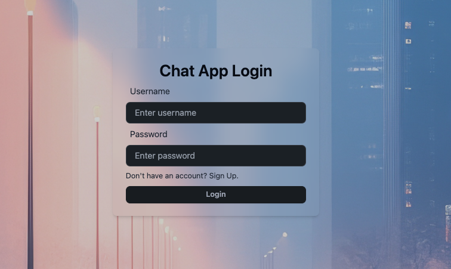
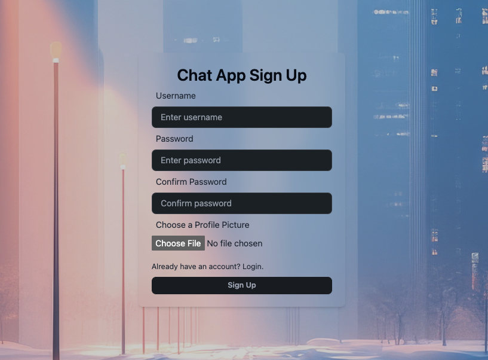
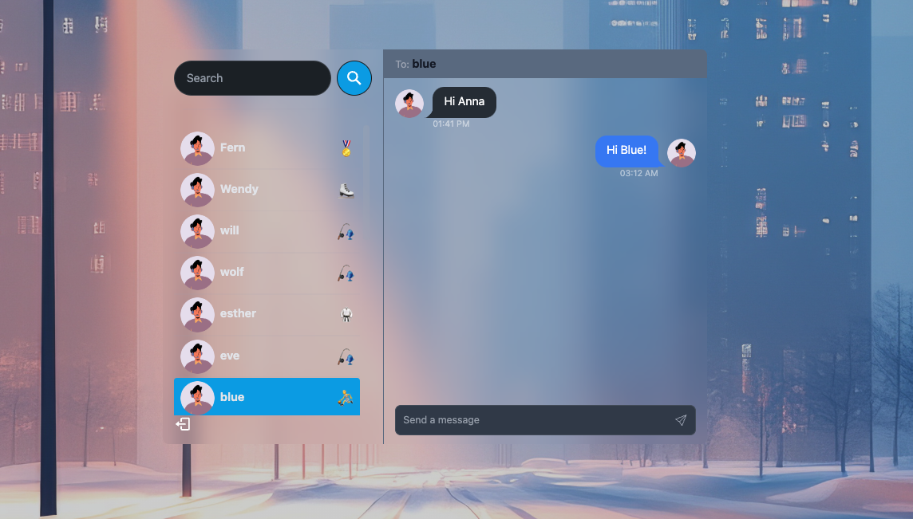

# Chat App

A messaging platform designed for seamless communication between users. Built with backend in Java (Spring Boot), a frontend in ReactJS, and MySQL database.

## Demo







## Features

- **Authentication & Authorization**

  - User login/registration with Spring Security.
  - JWT-based authentication.

- **One-to-One Chat**

  - Text messaging and timestamps.

- **Frontend (React)**

  - Responsive UI.
  - Chat thread with message input.

- **Backend (Java + Spring)**

  - REST APIs for chat functionalities.

- **Security**

  - Encrypted user password.

## In Progress

To do:

- Fix send message bug
- Implement real-time WebSocket communication using Spring WebSocket.
- Handle users' online status and real-time messaging.
- Add the ability to edit, delete, and manage read receipts for messages.
- Implement profile picture upload functionality.

## Run Locally

Clone the project

```bash
  git clone git@github.com:thyatran/chat-app.git
```

Navigate to the project directory

```bash
  cd chat-app
```

Install dependencies for Frontend (ReactJS)

```bash
  npm install
```

Start the Frontend Server

```bash
  npm run start
```

Set up the backend

```bash
  ./mvnw clean install
  ./mvnw spring-boot:run
```

## Application Properties

To run this project, you will need to add the following environment variables to your `application.properties` file

`application.properties`

```bash
  spring.application.name=RestAPI

  # MySQL DataSource Configuration
  spring.datasource.url=jdbc:mysql://localhost:3306/chat-app?useSSL=false&serverTimezone=UTC
  spring.datasource.username=root
  spring.datasource.password=dbpassword

  # Hibernate JPA Configuration
  spring.jpa.hibernate.ddl-auto=update
```

## Database Setup

1. Create a new MySQL database:

```bash
CREATE DATABASE chat-app;
```

2. Import the necessary schema or tables for your app from the `database/chat-app.mysql` directory if needed.
